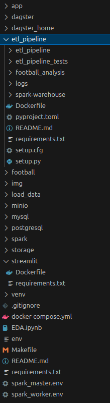
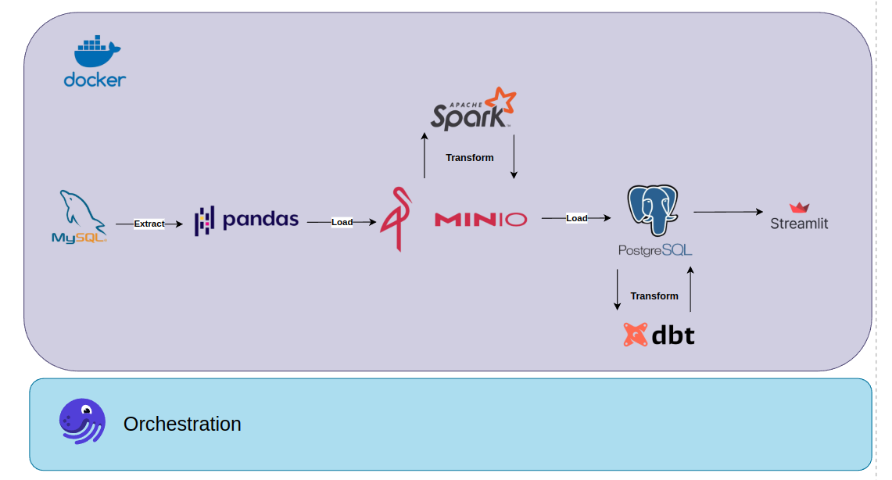
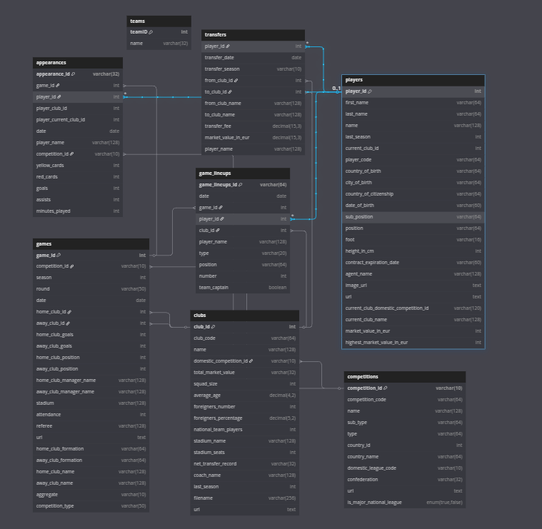
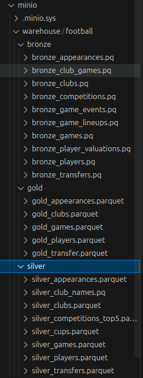
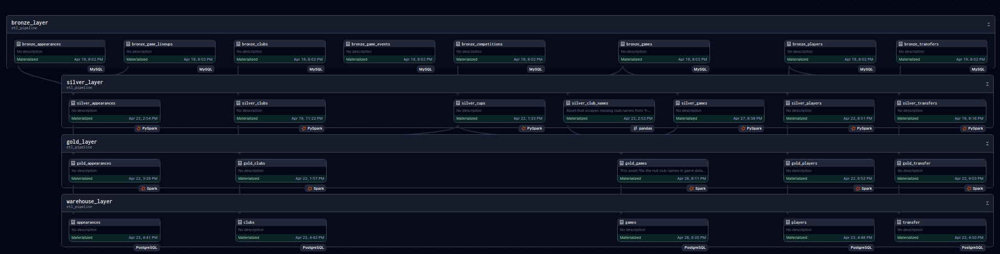
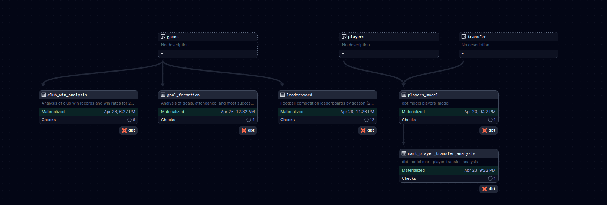
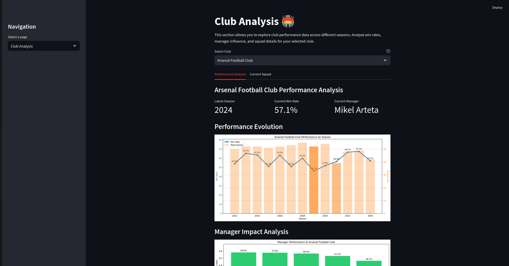
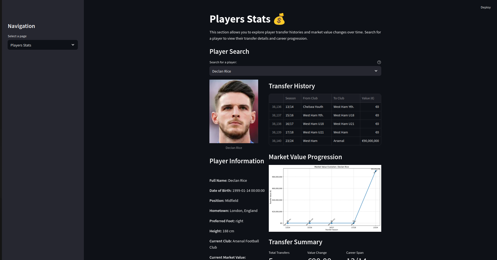

# Football-ETL-pipeline


This project is an ETL (Extract, Transform, Load) pipeline designed to collect and process data related to top European football matches, including leagues like the English Premier League (EPL) and Serie A, La Liga,… This project also has a UI for you to interact usign streamlit.


## 1. Objective
Dataset is collected from [Kaggle](https://www.kaggle.com/datasets/davidcariboo/player-scores)

The primary objective of this project is to build an ETL pipeline that extracts data from various sources, transforms it into a structured format, and loads it into a database. This data is then used to power a web application that provides users with search capabilities and rankings of top football matches in Europe.
## 2. Design

### 2.1 Directory tree


- `app`: The UI's application written with streamlit
- `dagster_home`: Dagit and dagster daemon's configurations
- `football`: Dataset under .csv format, in order to load into MySQL
- `docker-compose`: To compose docker containers

- `elt_pipeline`: The pipeline
  - `dbt_transform`: dbt's code location, used for the last transform step
  - `Dockerfile + requirements.txt`: Docker image
  - `etl_pipeline`: (Extract -> Transform -> Load) pipeline
- `.env + .spark_master.env + .spark_worker.env`: Env variables (e.g POSTGRES_USER, MYSQL_USER, SPARK, ...)
- `env.template`: Env variables template
- ` .gitignore`: Code versioning
- `Makefile`: Shortcut for terminal's commands
- `load_data`: .sql scripts to create schema and load `dataset` into MySQL, Postgres
- `requirements.txt `: Python's dependencies
In addition, the containers also have their own separate directories, which include:

- `minio`
- `storage`
  - `mysql_data`
  - `postgres_data`
  - `metabase_data`
### 2.2 Data pipeline


0. We use docker to containerize the application and dagster to orchestrate assets (as defined in dagster's [documentation](https://docs.dagster.io/concepts/assets/software-defined-assets)).
1. The dataset is downloaded from Kaggle in `.csv` format, then imported into `MySQL` to simulate development data
2. Extract the table-formatted data above using `pandas`, and load it into the datalake - `MinIO`.
3. From `MinIO`, load data into `spark` to transform from raw into silver & gold
4. Convert `Spark DataFrame` to `.parquet`, and load back to `MinIO`, then fill the null value using `BeautifulSoup` for games table.
5. Load gold layer into data warehouse - postgreSQL, creating the warehouse layer.
7. Transform as needed using `dbt` on `postgres`
9. Create an app using `streamlit`

### 2.3 Database schema



### 2.4 Datalake


The datalake is divided into three layers: bronze, silver, and gold.
All files are under the .parquet format for better reading performance than .csv.
### 2.5 Data lineage



You can get access to this lineage by using   [Dagster ui](localhost:3001)
## 3. Setup
- Docker desktop
- Dbeaver or any other DB client
- If using Windowns, install Linux on Windowns with WSL 

### 3.1 Git clone
```bash
git clone https://github.com/lelouvincx/goodreads-elt-pipeline.git project
cd project
```

Download the csv dataset [here](https://www.kaggle.com/datasets/davidcariboo/player-scores), then place it in `football`
### 3.2 Setup local

**#create docker**

`make build`

`make up`

### 3.3 Import data into MySQL

**#copy data from local to docker**

`docker cp football/ de_mysql:/tmp/`

**#enable access**

`make to_mysql_root`

`SHOW GLOBAL VARIABLES LIKE 'LOCAL_INFILE';`

`SET GLOBAL LOCAL_INFILE=TRUE;`

`exit`

**#create tables with schema**

`make mysql_create`

**#load csv into created tables**

`make mysql_load`

**#set the foreign key constraints**

`make to_mysql`
-then paste those lines on cli to set the foreign key.

### 3.4 Create schema in PostgresSQL

**#create tables with schema**

`make psql_create`

## 4. Demo
You can get access to this lineage by using   [Streamlit](localhost:8501)




## 5. Further actions
1. Complete the  system
2. Integrate Jupyter Notebook for DS tasks - [dagstermill](https://docs.dagster.io/integrations/dagstermill)
3. Making a streaming process to get realtime data 

## 6. User interfaces:
1. <http://localhost:3001> - Dagit
2. <http://localhost:4040> - Spark jobs
3. <http://localhost:8080> - Spark master
4. <http://localhost:9001> - MinIO
5. <http://localhost:3030> - Metabase
6. <http://localhost:8501> - Streamlit